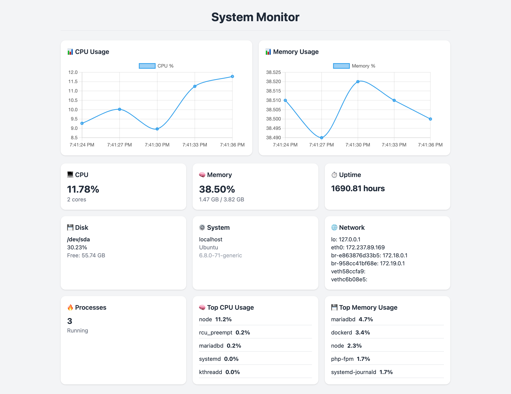

# SysMon - System Monitoring Dashboard

Simple server monitoring dashboard built with **Express + TypeScript**.

## ✨ Features

- CPU, Memory, Disk, Uptime monitoring
- Basic Authentication
- Rate Limiting
- Real-time updates (no refresh)

## 🧱 Tech Stack

- Express.js + TypeScript
- Tailwind CSS

## ⚙️ Run Locally

```bash
npm install
npm run lint
npm run build
npm start
```

Create `.env` ( or copy from `.env.example` ):

```bash
cp .env.example .env
```

```env
APP_NAME=SysMon
PORT=3000
AUTH_USER=admin
AUTH_PASSWORD=admin
RATE_LIMIT_MAX=100
```

## 🔍 Test

- lint test

## 🚀 Deployment

- VPS
- PM2 process manager
- Auto deploy via GitHub Actions

## 🎯 Purpose

Built to:

- Server Monitoring
- Backend structuring (Express)
- CI/CD pipeline
- Production deployment
- Just for fun

## 📸 Preview



---

**MIT LICENSE**
